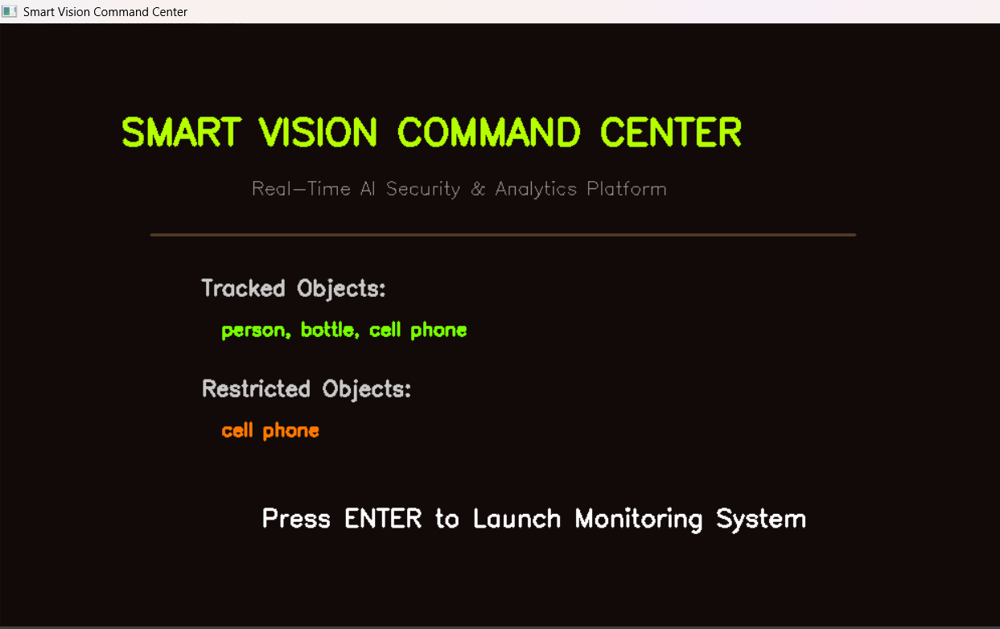

# Smart Vision Command Center

An AI-powered real-time object monitoring and security analytics system built using YOLOv8 and OpenCV.

Smart Vision Command Center is a fullscreen, real-time monitoring platform capable of detecting, tracking, and analyzing objects through a live camera feed. It features intelligent stability filtering, restricted object alerting, a visual analytics dashboard, and a professional user interface.

---

## Current Stable Version
V2.2

---

## Key Features

• Real-time object detection using YOLOv8  
• Sliding window stability filtering to reduce false positives  
• Configurable restricted object alert system  
• Loud / Subtle alert mode toggle  
• Immersive fullscreen monitoring interface  
• FPS performance indicator  
• Structured analytics dashboard  
• Object presence tracking with visual indicators  
• Screenshot logging of alert events  
• Clean version-based development structure  

---

## System Architecture

Detection Engine  
YOLOv8 (Ultralytics) handles real-time object detection.

Stability Engine  
A sliding window confirmation mechanism ensures detections are stable before being marked as present.

Alert System  
Restricted objects trigger visual border alerts, audio notifications, and screenshot logging.

Dashboard Layer  
Displays system runtime, alert count, alert mode, tracked object presence, FPS, and last event information.

---

## Default Configuration

Tracked Objects:
person, bottle, cell phone

Restricted Objects:
cell phone

These values can be modified directly inside the script configuration section.

---

## Installation Guide

### 1. Create Python Environment

Recommended Python version: 3.10

conda create -n vision_env python=3.10  
conda activate vision_env  

### 2. Install Dependencies

pip install -r requirements.txt  

### 3. Run the System

Navigate to:

Smart_Object_Vision_System_V2  

Then execute:

python vision_command_center_v2_2.py  

On first run, YOLOv8 model weights will download automatically.

---

## Controls

Q → Quit  
A → Toggle Alert Mode (LOUD / SUBTLE)  
D → Toggle Dashboard  

---

## Technical Stack

Python 3.10  
OpenCV  
Ultralytics YOLOv8  
NumPy  
Windows Winsound  

---

## Project Motivation

This project explores the intersection of real-time AI detection, UI system design, and intelligent alert logic.

It demonstrates:

• Applied computer vision  
• System state management  
• UI/UX refinement using OpenCV  
• Stability-based detection engineering  
• Structured version-based development  

---

## Preview (Optional - Add Screenshots)

Create an "assets" folder and add screenshots, then reference them like this:

  
  

---

## Author

Subroto Sarkar  
Lead Developer  

AI Architecture & Technical Guidance: OpenAI Assistant  

© 2026 Subroto Sarkar. All Rights Reserved.
